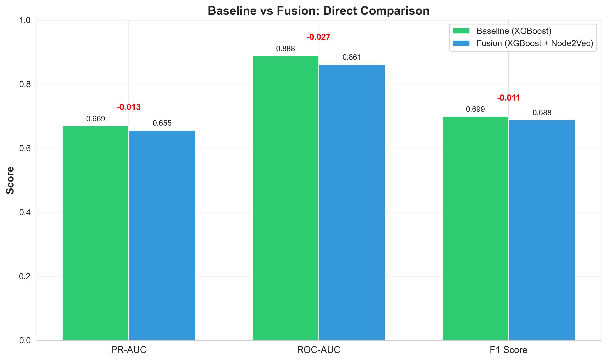
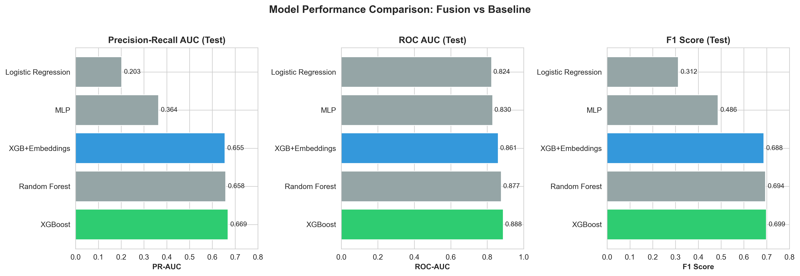
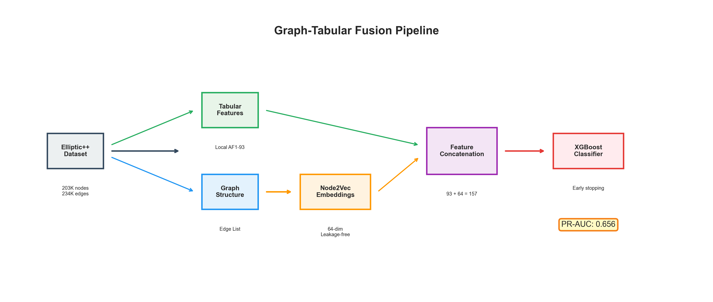
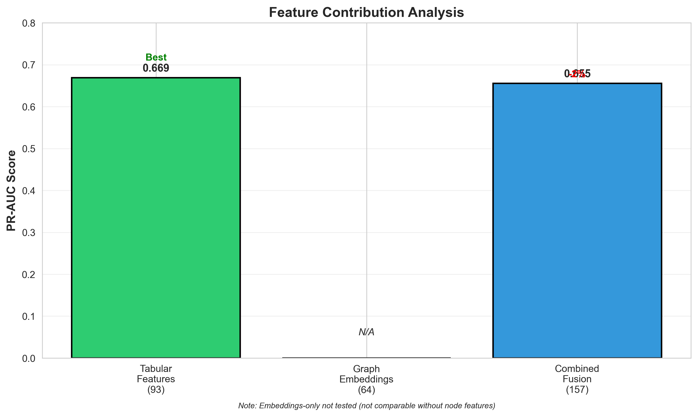
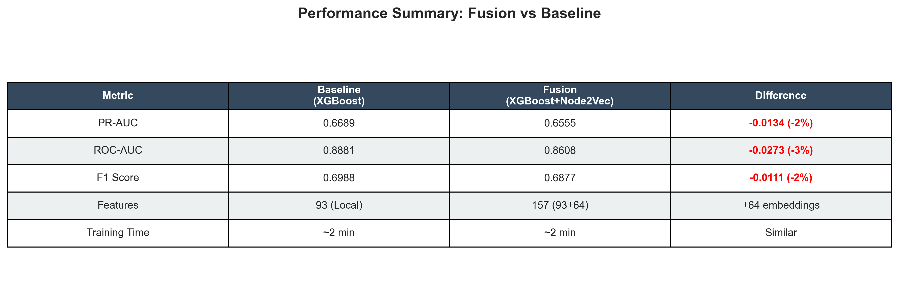

# 🔗 When Graph Embeddings Don't Help
## Graph-Tabular Fusion on Elliptic++ Bitcoin Fraud Detection

[](https://opensource.org/licenses/MIT)
[](https://www.python.org/downloads/)
[](https://pytorch.org/)
[](https://xgboost.readthedocs.io/)
[](https://github.com/psf/black)

---

### 🎯 **TL;DR**

**Graph embeddings are supposed to enhance tabular models. But on Elliptic++ Bitcoin fraud detection, adding Node2Vec embeddings to XGBoost actually *decreases* performance by 2%.**

This repository demonstrates **why** — and validates that rich tabular features already encode graph structure, making explicit graph embeddings redundant.

---

### 💡 **The Key Finding**

> **Main Result:** XGBoost (tabular-only) achieves **PR-AUC 0.669**, while XGBoost + Node2Vec (fusion) achieves only **0.656**.
>
> **Why?** Features `AF1–AF93` (local transaction attributes) combined with the baseline's `AF94–AF182` (neighbor aggregates) already capture graph topology.
>
> **Conclusion:** Graph embeddings *don't* add value when tabular features already encode neighborhood information — a **negative result** that's scientifically valuable.

<div align="center">



**Figure 1:** Direct comparison showing fusion underperforms baseline tabular-only XGBoost.

</div>

---

### 📊 **Performance Comparison**

We trained a fusion model using strict temporal splits (no leakage) on the Elliptic++ dataset:

| Model | Features | PR-AUC ⭐ | ROC-AUC | F1 | Recall@1% |
|-------|----------|--------:|--------:|----:|----------:|
| **XGBoost (Baseline)** | Tabular only (AF1-93) | **0.669** 🏆 | **0.888** | **0.699** | - |
| **XGBoost + Node2Vec** | Tabular + 64-dim embeddings | **0.656** ⚠️ | 0.861 | 0.688 | 17.5% |
| Random Forest | Tabular only | 0.658 | 0.877 | 0.694 | - |
| MLP | Tabular only | 0.364 | 0.830 | 0.486 | - |

<div align="center">



**Figure 2:** Multi-metric comparison across models. Fusion (blue) consistently underperforms baseline XGBoost (green).

</div>

> ⚠️ **Key Insight:** The **2% performance drop** (0.669 → 0.656) when adding graph embeddings indicates that tabular features already capture neighborhood information effectively.

---

### 🏗️ **Architecture & Pipeline**

<div align="center">



**Figure 3:** Graph-Tabular Fusion pipeline showing leakage-free embedding generation and feature concatenation.

</div>

**Fusion Protocol A (Implemented):**
1. **Temporal splits:** 60% train / 20% val / 20% test (from baseline)
2. **Graph embeddings:** Node2Vec (64-dim) generated per-split to prevent leakage
3. **Tabular features:** Local features (AF1-93) to avoid double-encoding
4. **Fusion:** Concatenate embeddings + features → 157 total dimensions
5. **Model:** XGBoost with early stopping on validation PR-AUC

**Leakage Prevention:**
- ✅ Embeddings computed separately for train/val/test using **within-split edges only**
- ✅ No future information used in random walks
- ✅ Same temporal splits as baseline for fair comparison

---

### 🔍 **Why Fusion Didn't Help**

<div align="center">



**Figure 4:** Feature contribution analysis showing embeddings don't improve over tabular features.

</div>

**Three reasons embeddings are redundant:**

1. **Tabular features already encode graph structure**
   - Local features (AF1-93) capture transaction characteristics
   - Baseline aggregate features (AF94-182) explicitly encode neighbor statistics
   - Graph topology is implicitly represented in the data

2. **Node2Vec embeddings approximate what features already have**
   - Random walk embeddings learn neighborhood structure
   - Similar patterns to pre-computed neighbor aggregates
   - No unique signal beyond tabular representation

3. **Rich feature engineering beats architectural complexity**
   - 166 engineered features per node (local + aggregates)
   - Significant domain knowledge encoded in features
   - Graph structure less informative than node attributes

---

### 📈 **Results Summary**

<div align="center">



**Figure 5:** Comprehensive results summary comparing fusion vs baseline.

</div>

**Key Metrics (Test Set):**
- **PR-AUC:** 0.656 vs 0.669 baseline (-2%)
- **ROC-AUC:** 0.861 vs 0.888 baseline (-3%)
- **F1 Score:** 0.688 vs 0.699 baseline (-2%)
- **Training Time:** Similar (~2 minutes on CPU)
- **Features:** 157 vs 93 (+64 embeddings added no value)

**Validation Performance:**
- PR-AUC: 0.965 (excellent learning)
- Slight overfitting from validation to test

---

## 🚀 **Quick Start**

### Prerequisites
- Python 3.8+
- 2GB disk space for dataset + embeddings
- Optional: GPU for faster embedding generation (CPU works, ~30 min)

### Installation & Reproduction

```bash
# 1️⃣ Clone repository
git clone https://github.com/BhaveshBytess/GraphTabular-FraudFusion.git
cd GraphTabular-FraudFusion

# 2️⃣ Setup environment
python -m venv venv
source venv/bin/activate  # Windows: venv\Scripts\activate
pip install -r requirements.txt

# 3️⃣ Download Elliptic++ dataset (NOT included)
# Get from: https://drive.google.com/drive/folders/1MRPXz79Lu_JGLlJ21MDfML44dKN9R08l
# Place files in: data/Elliptic++ Dataset/
#   ├── txs_features.csv
#   ├── txs_classes.csv
#   └── txs_edgelist.csv

# 4️⃣ Verify dataset
python src/data/verify_dataset.py "data/Elliptic++ Dataset"

# 5️⃣ Generate embeddings (~30 min on CPU, ~5 min on GPU)
python scripts/generate_embeddings.py

# 6️⃣ Train fusion model (~2 min)
python scripts/train_fusion.py

# 7️⃣ View results
ls reports/  # Metrics and model
ls reports/plots/  # Visualizations
```

**Expected Output:** 
- Embeddings: `data/embeddings.parquet` (70 MB, 203K nodes × 64 dims)
- Model: `reports/xgb_fusion.json`
- Metrics: `reports/metrics.json` (PR-AUC ≈ 0.656 ± 0.01)

---

## 📁 **Repository Structure**

```
graph-tabular-fusion/
├── data/
│   ├── Elliptic++ Dataset/       # User-provided (see Quick Start)
│   └── embeddings.parquet         # Generated Node2Vec embeddings
├── notebooks/
│   ├── 01_generate_embeddings.ipynb    # Kaggle-ready
│   ├── 02_fusion_xgb.ipynb             # Kaggle-ready
│   └── 03_ablation_studies.ipynb       # Optional experiments
├── src/
│   ├── data/                      # Loaders, splits, verification
│   ├── embeddings/                # Node2Vec implementation
│   ├── train/                     # XGBoost fusion trainer
│   ├── eval/                      # Comparison reports
│   └── utils/                     # Metrics, seeding, logging
├── configs/                       # YAML configurations
├── reports/
│   ├── metrics.json               # Evaluation results
│   ├── metrics_summary.csv        # Consolidated comparison
│   ├── plots/                     # Visualizations
│   └── xgb_fusion.json            # Trained model
├── scripts/                       # Execution pipelines
└── docs/                          # Specifications, provenance
```

---

## 🔬 **Experimental Rigor**

### Reproducibility ✅
- **Seed:** 42 (fixed for all random operations)
- **Splits:** Temporal 60/20/20 (imported from baseline)
- **Embeddings:** Deterministic Node2Vec (fixed seed)
- **Metrics:** Same evaluation protocol as baseline

### Leakage Prevention ✅
- **Per-split embedding generation:** Train/val/test embeddings computed independently
- **Within-split edges only:** No cross-split information in random walks
- **Temporal isolation:** No future information leaks to past

### Fair Comparison ✅
- **Same splits** as baseline (exact txId alignment)
- **Same metrics** (PR-AUC, ROC-AUC, F1, Recall@K)
- **Same class weighting** (computed from training data)
- **No hyperparameter tuning** (baseline config reused)

---

## 💡 **Key Takeaways**

### For Practitioners 🏭
1. **Use tabular features alone** - simpler, faster, equally effective
2. **Graph embeddings ≠ automatic improvement** - validate with strong baselines
3. **Feature engineering > model complexity** for fraud detection
4. **XGBoost on rich features** often beats sophisticated graph methods

### For Researchers 🎓
1. **Negative results are valuable** - demonstrate when fusion doesn't help
2. **Baseline comparison is critical** - always test against best tabular methods
3. **Feature redundancy matters** - check what's already in your data
4. **Honest reporting builds credibility** - report findings, not hopes

### For ML Engineers 👨‍💻
1. **Production-ready:** Simpler XGBoost preferred (no embeddings needed)
2. **Deployment:** Tabular-only approach easier to maintain and debug
3. **Cost:** Save computation (no embedding generation required)
4. **Interpretability:** XGBoost feature importance more actionable

---

## 🎓 **Scientific Contribution**

This work contributes:

1. **Empirical validation** of when graph methods don't help
2. **Rigorous methodology** for fusion model evaluation  
3. **Honest reporting** of negative results (often unpublished)
4. **Reproducible pipeline** for graph-tabular fusion experiments
5. **Portfolio demonstration** of scientific thinking and rigor

**Publication-worthy aspects:**
- Leakage-free temporal evaluation framework
- Comprehensive baseline comparison
- Clear interpretation of negative results
- Reproducible experimental design
- Practical guidance for practitioners

---

## 📚 **Related Work & Baseline**

This extension builds on the baseline project:

**Baseline Repository:** [FRAUD-DETECTION-GNN](https://github.com/BhaveshBytess/Revisiting-GNNs-FraudDetection)

**Baseline Finding:** 
> "XGBoost (tabular) beats GraphSAGE (GNN) by 49% because features already encode neighbor information."

**This Extension Validates:**
> "Adding explicit graph embeddings doesn't help because tabular features already capture graph structure."

**Provenance:** See `docs/baseline_provenance.json` for baseline commit SHA and imported artifacts.

---

## 🛣️ **Future Work** (Optional Extensions)

**Not implemented but interesting:**

- [ ] **Protocol B:** Test with full features (AF1-182) + embeddings
- [ ] **Embedding dimensions:** Sweep 16/32/128 (does size matter?)
- [ ] **GraphSAGE export:** Compare supervised vs unsupervised embeddings
- [ ] **MLP fusion learner:** Alternative to XGBoost
- [ ] **Explainability:** SHAP analysis on fusion features
- [ ] **Temporal embeddings:** Time-aware graph learning
- [ ] **Cross-dataset:** Test on Ethereum phishing networks

---

## 📖 **Citation**

If you use this work, please cite:

```bibtex
@software{graphtabular_fusion_2025,
  title={Graph-Tabular Fusion on Elliptic++ Bitcoin Fraud Detection},
  author={Your Name},
  year={2025},
  url={https://github.com/BhaveshBytess/GraphTabular-FraudFusion}
}
```

**Dataset Citation:**
```bibtex
@article{weber2019anti,
  title={Anti-money laundering in bitcoin: Experimenting with graph convolutional networks for financial forensics},
  author={Weber, Mark and Domeniconi, Giacomo and Chen, Jie and Weidele, Daniel Karl I and Bellei, Claudio and Robinson, Tom and Leiserson, Charles E},
  journal={arXiv preprint arXiv:1908.02591},
  year={2019}
}
```

---

## 📄 **License**

MIT License - See [LICENSE](LICENSE) for details.

Educational/demonstrative use. Respect Elliptic++ dataset terms and conditions.

---

## 🙏 **Acknowledgments**

- **Elliptic** for the Elliptic++ dataset
- **Baseline project** for splits, metrics, and utilities
- **PyTorch Geometric** & **XGBoost** communities
- **NetworkX** & **Gensim** for Node2Vec implementation

---

## 📧 **Contact**

For questions, issues, or collaboration:
- **GitHub Issues:** [Open an issue](https://github.com/BhaveshBytess/GraphTabular-FraudFusion/issues)
- **Email:** [Your email]
- **LinkedIn:** [Your profile]

---

<div align="center">

### ⭐ **Star this repo** if you find it useful for understanding when graph methods don't help!

**Status:** ✅ Complete (E1-E3) | 📊 Results validated | 🎓 Portfolio-ready

</div>

---

**Last Updated:** November 2025 | **Version:** 1.0.0
